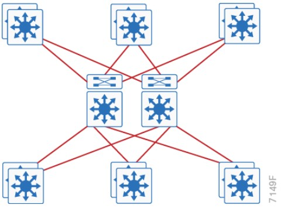
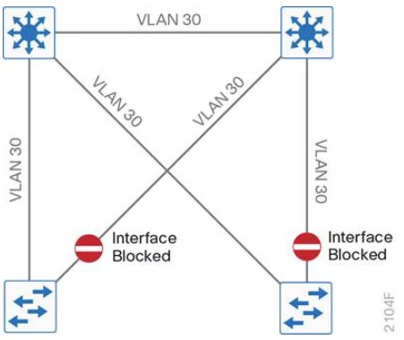
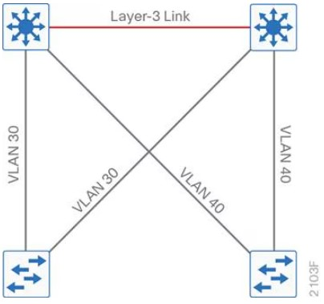

- Campus networks are always oversubscribed.
- Over-subscription rates between 4-20 are common.
- Networks with over-subscription should implement QoS so voice traffic isn't queued.

# Access Layer
- 9200
- 9300
- 9400 (modular chassis)

**Considerations**
 
- mGig, so access speeds can scale
- UPOE+, 90W with perpetual power (survives reboots)

# Distribution Layer
- 9400 (modular chassis)
- 9500
- 9600 (modular chassis)

**Considerations**

- Service heavy (FHRPs, Routing, SVIs)
- Typical L2 boundary
- Used to interconnect all the access layer switches in a building
- Used to interconnect Access layer switches, once they can't form a full-mesh
- Also contains the failure domain of the access layer.
- Simplified Distribution, using stackwise virtual to remove FHRP.

# Core Layer
- 9500
- 9600 (modular chassis)

**Considerations**

- No services
- Layer 3 only
- Always on
- Ideally, a minimum of 100G to conserve ports.

# Two Tier Collapsed Core
- The core and distribution switches are the same
- The center is running StackWise Virtual

# Three Tier

# Layer 2 Access with traditional multilayer
- Layer 2 is a single wiring closest, or access uplink pair.
- FHRP is used, but limits bandwidth to one uplink, vs both.

**Traditional Design**

- Needs STP to block ports

**Traditional Design - Loop Free**

# References
https://www.cisco.com/c/en/us/td/docs/solutions/CVD/Campus/cisco-campus-lan-wlan-design-guide.html