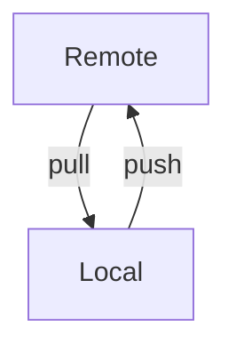
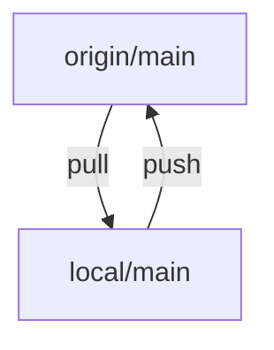

# Git

Repository
: AKA, a Repo. Git stores version history, called commits in a repository.

Commit
: A database entry in the repo, that contains the information necessary to play forward a set of changes, based on file deltas.
 

Git keeps repositories in sync via version control. There is the local repo and the remote repo.



The default name for the device holding the remote repo is `origin`.

The default branch in a newly created repo is `main`.



## Logs

```plain
git log --oneline
```


```plain
commit -m "This is why I did the commit"
```


## Updating History

Making a change on the remote, to the *commit history itself* requires force.

The safer way to do this is per-branch, not the entire repo.

```plain
git push origin +main
```

## References

[Git - User-Manual Documentation](https://git-scm.com/docs/user-manual.html)
