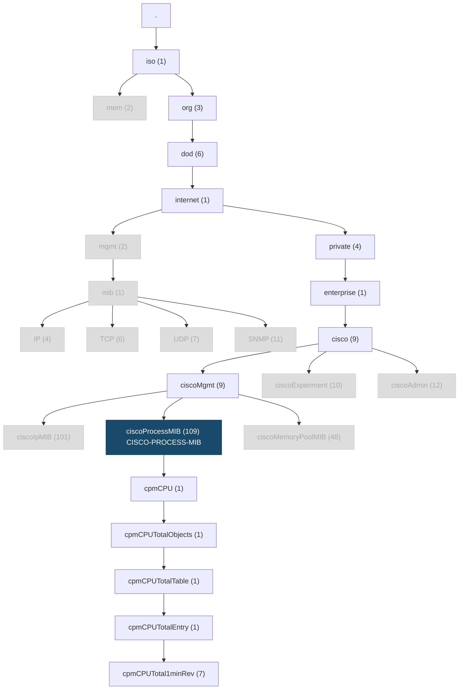

```mermaid
graph TD
    dot["."]
    dot --> iso["iso (1)"]
    iso --> mem["mem (2)"]
    iso --> org["org (3)"]
    org --> dod["dod (6)"]
    dod --> internet["internet (1)"]
    
    internet --> mgmt["mgmt (2)"]
    internet --> private["private (4)"]
    
    mgmt --> mib["mib (1)"]
    private --> enterprise["enterprise (1)"]
    
    mib --> ip["IP (4)"]
    mib --> tcp["TCP (6)"]
    mib --> udp["UDP (7)"]
    mib --> snmp["SNMP (11)"]
    enterprise --> cisco["cisco (9)"]

    cisco --> ciscoMgmt["ciscoMgmt (9)"]
    cisco --> ciscoExperiment["ciscoExperiment (10)"]
    cisco --> ciscoAdmin["ciscoAdmin (12)"]

    ciscoMgmt --> ciscoIpMIB["ciscoIpMIB (101)"]
    ciscoMgmt --> ciscoProcessMIB["ciscoProcessMIB (109) CISCO-PROCESS-MIB"]
    ciscoMgmt --> ciscoMemoryPoolMIB["ciscoMemoryPoolMIB (48)"]

    ciscoProcessMIB --> cpmCPU["cpmCPU (1)"]
    cpmCPU --> cpmCPUTotalObjects["cpmCPUTotalObjects (1)"]
    cpmCPUTotalObjects --> cpmCPUTotalTable["cpmCPUTotalTable (1)"]
    cpmCPUTotalTable --> cpmCPUTotalEntry["cpmCPUTotalEntry (1)"]

    cpmCPUTotalEntry --> cpmCPUTotal1minRev["cpmCPUTotal1minRev (7)"]

    style mem                   fill:#ddd,color:#aaa,stroke:#ccc
    style mgmt                  fill:#ddd,color:#aaa,stroke:#ccc
    style mib                   fill:#ddd,color:#aaa,stroke:#ccc
    style ip                    fill:#ddd,color:#aaa,stroke:#ccc
    style tcp                   fill:#ddd,color:#aaa,stroke:#ccc
    style udp                   fill:#ddd,color:#aaa,stroke:#ccc
    style snmp                  fill:#ddd,color:#aaa,stroke:#ccc
    style ciscoExperiment       fill:#ddd,color:#aaa,stroke:#ccc
    style ciscoAdmin            fill:#ddd,color:#aaa,stroke:#ccc
    style ciscoIpMIB            fill:#ddd,color:#aaa,stroke:#ccc
    style ciscoMemoryPoolMIB    fill:#ddd,color:#aaa,stroke:#ccc
    
    style ciscoProcessMIB fill:#1a4a6b,color:#fff,stroke:#1a4a6b
```